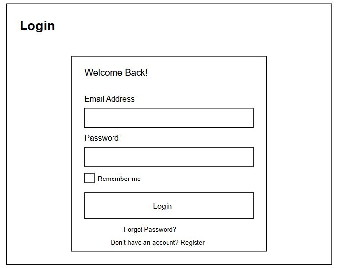
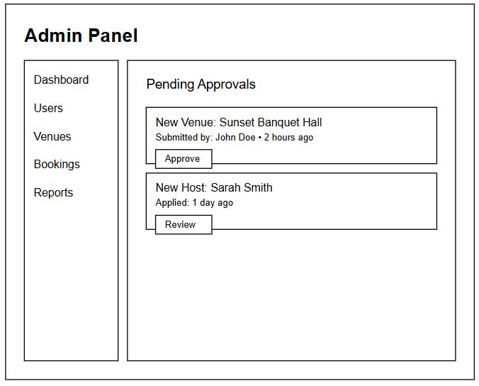
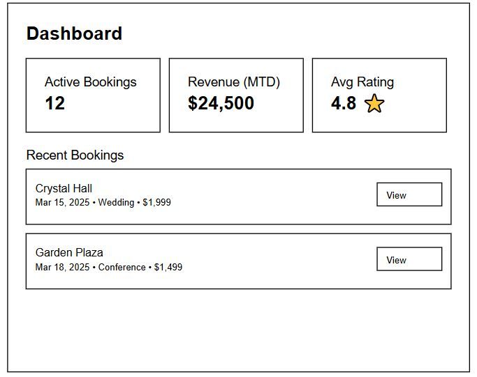
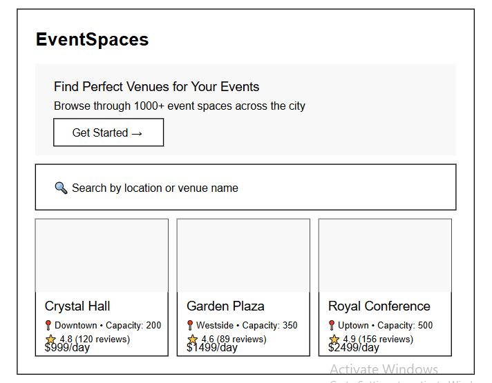
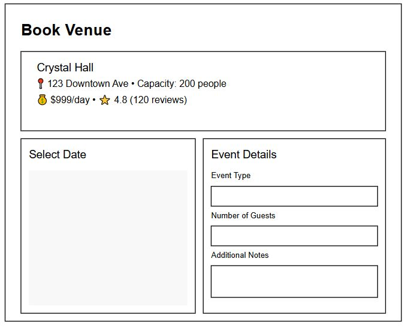

# 📌 Event Hall Booking System

## 📖 Overview
The **Event Hall Booking Website** is a full-stack web application that enables users to book event halls, hall owners to manage their listings, and admins to oversee transactions and approvals. The platform provides a **user-friendly interface** for seamless booking, secure payments, and efficient management of event spaces.

## 🎯 Features
### 👥 User Roles
- **Admin**: Manages users, event halls, and payments.
- **Hall Owners**: List halls, manage bookings, and track payments.
- **Customers**: Browse, filter, and book event halls.

### 🔑 Authentication & Authorization
- User registration and login (Admin, Hall Owner, Customer)
- Secure authentication using JWT

### 🏛️ Event Hall Management
- Hall owners can **add, update, and remove** their halls
- Admin **approves or rejects** hall listings
- Customers can **view details and book halls**

### 📅 Booking System
- Real-time **availability check**
- Customers select **date, time, and additional preferences**
- Booking confirmation & history tracking

### 💳 Payments
- Secure online payments using **Razorpay**
- Transaction history for **owners and customers**

## 🛠️ Tech Stack
### **Frontend:**
- React.js (UI Development)
- Tailwind CSS / Bootstrap (Styling)

### **Backend:**
- Node.js with Express.js (RESTful API)
- JWT for authentication

### **Database:**
- MongoDB with Mongoose (NoSQL database)

### **Payment Integration:**
- Razorpay API

## 🚀 Installation & Setup

### 📌 Prerequisites
Make sure you have the following installed:
- Node.js & npm
- MongoDB (Local or Atlas)
- Git

### ⚙️ Backend Setup
```sh
cd backend
npm install   # Install dependencies
npm start     # Start the backend server (Ensure package.json has a start script)
```

### 🎨 Frontend Setup
```sh
cd frontend
npm install   # Install dependencies
npm start     # Run React app
```

## 📌 API Endpoints
| Method | Endpoint               | Description |
|--------|------------------------|-------------|
| POST   | /api/auth/register     | Register a new user |
| POST   | /api/auth/login        | User login |
| GET    | /api/halls             | Fetch all event halls |
| POST   | /api/halls/add         | Add a new event hall (Hall Owner) |
| POST   | /api/bookings          | Create a new booking |

# Login page

# Admin Dashboard 

# Hall Owner Dashboard

# Consumer Dashboard

# Booking page


